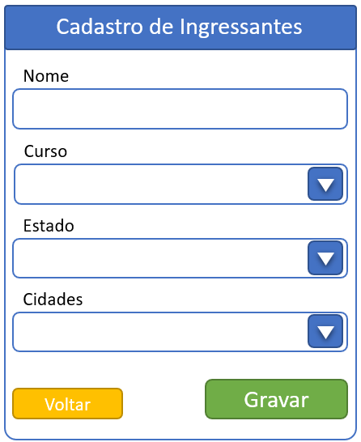

# Desafio React

# Objetivo

> Esse desafio tem por objetivo medir as capacidades técnicas para
> requisitos front-end em React®.

# Stack tecnológico

> React versão mais recente.

# Nível

> Básico -- Capacidade de interpretar um leiaute e criar os componentes
> utilizando React.

# Problema

> O cliente solicita um formulário de cadastramento de ingressantes e
> que contenham as seguintes características:

a.  {width="2.2333333333333334in"
    height="2.734027777777778in"}**Construir um formulário que tem tenha
    o seguinte layout:**

b.  **Preencher a lista de Cursos com os seguintes itens:**

> \- Matemática;
>
> \- Letras
>
> \- Geografia.

c.  **Preencher a lista de Estados com os seguintes itens:**

> \- São Paulo;
>
> \- Rio de Janeiro;
>
> \- Minas Gerais.

d.  **Implementar a funcionalidade a seguir:**

> Ao selecionar um item da lista de estados o campo de cidade deve ser
> preenchido com as cidades daquele estado seguindo as regras abaixo:

-   Para São Paulo: Mogi das Cruzes, Suzano, Poá e Guararema;

-   Para Rio de Janeiro: Angra dos Reis, Niterói e Itaboraí;

-   Para Minas Gerais: Belo Horizonte; Monte Azul e Muzambinho;
